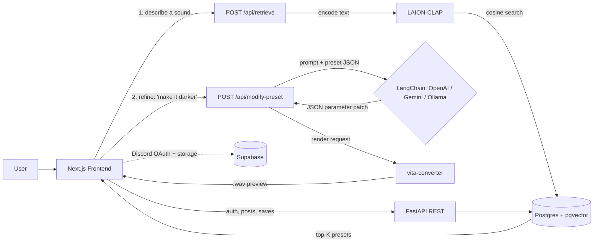

# Resonance

**Describe a sound. Get a synth preset.**

Resonance is an AI-powered discovery platform for Vital synthesizer presets. Describe the sound you want in plain English, and Resonance retrieves, previews, and lets you conversationally refine matching presets from a shared preset bank — no more scrolling through hundreds of vaguely-named patches.

[](https://nextjs.org/)
[](https://react.dev/)
[](https://fastapi.tiangolo.com/)
[](https://www.postgresql.org/)
[](https://www.docker.com/)
[](LICENSE)

**Live demo:** *resonance.dog is currently offline — hosting was paused to control database/LLM inference costs. See [Setup](#setup) to run the full stack locally.*

---

## Table of Contents
- [About This Project](#about-this-project)
- [Team](#team)
- [Overview](#overview)
- [Demo](#demo)
- [Features](#features)
- [How It Works](#how-it-works)
- [Tech Stack](#tech-stack)
- [API Overview](#api-overview)
- [Project Structure](#project-structure)
- [Setup](#setup)
- [Roadmap and Known Limitations](#roadmap-and-known-limitations)
- [License](#license)

## About This Project

Resonance (originally prototyped as **SynthGPT**) was built as the final project for **UC Santa Cruz's CSE 115A: Introduction to Software Engineering**, developed over four Agile sprints:

| Sprint | Focus |
|---|---|
| 1 — LLM Setup | Scoped the project, defined the preset/feature-vector schema, first LLM integration |
| 2 — Similarity & Retrieval | Preset embedding pipeline, cosine-similarity search over presets |
| 3 — Augmentation & Generation | Conversational preset modification, parameter patching, audio rendering |
| 4 — Frontend & API | Full Next.js UI, FastAPI surface, auth, community features, deployment |

The original [design doc](https://docs.google.com/document/d/1fjcCDi37jTIdLPnzqegn9-f0nV_zfa3y4LIupi6vKZY/edit?usp=sharing) proposed a hand-labeled *perceptual feature space* (brightness, warmth, aggression, distortion, movement, density, noisiness, punch, space) with an LLM classifying requests into discrete buckets (`extreme` → `1.0`, `high` → `0.9`, ... `none` → `0`). During implementation the team pivoted to pretrained LAION-CLAP embeddings for retrieval, which removed the need to manually label a preset bank, while an LLM-driven JSON parameter patch handles fine-tuning directly against Vital's real parameters.

The presets used during development were sourced from a [shared Vital preset bank](https://drive.google.com/drive/folders/1iA4oPEGfsbhIeDHKhnUd0iGXqhDZfTs-?usp=sharing).

## Team

| Name | GitHub |
|---|---|
| Andrew Weckwerth | [@andrewchimney](https://github.com/andrewchimney) |
| Luiz Blum | [@LuizCauet](https://github.com/LuizCauet) |
| Dylan Brewer-Fong | [@dylanbrewerfong](https://github.com/dylanbrewerfong) |
| Louie Hidalgo | [@ldhidalgo3](https://github.com/ldhidalgo3) |
| Steven Hong | — |
| Shiva Ravinutala | [@ShivaRavinutala](https://github.com/ShivaRavinutala) |

## Overview

Sound design is one of the biggest barriers in music production. Synthesizers like Vital ship with thousands of presets, but they're usually named things like *"Memory Leak"* or *"Banana Wob"* — creative, but useless for finding a specific sound. Producers are left scrolling and auditioning presets one by one, or building patches from scratch, which requires deep synthesis expertise.

Resonance replaces that search with language. Describe the sound you want — *"a fat, aggressive bass for a hip-hop track"* — and Resonance retrieves the closest-matching presets from a shared bank, lets you audition them instantly, and refines them conversationally until they're right. Every result is a real, downloadable `.vital` preset.

## Demo

[Watch the video demo](https://youtu.be/h_kILWrje5k) for a full walkthrough of generation, refinement, and the community feed.

## Features

**AI-Powered Generation** — Describe a sound in plain English and get back 5 ranked Vital preset matches, each with a match score, instant audio preview, and one-click `.vital` download.

**Conversational Refinement** — Keep tweaking a result conversationally (*"make it darker"*, *"add more punch"*); the assistant edits the underlying synth parameters, re-renders a fresh preview, and explains what it changed.

**Community Browse Feed** — Explore presets shared by other users, sorted by newest or trending (a time-decayed score similar to a "hot" ranking), with full-text search.

**Posting & Sharing** — Publish a preset anonymously or under your account, with an optional title/description, and see it appear in the shared feed and your profile.

**Profiles & Personalization** — Discord-based login (via Supabase Auth), a searchable user directory, a saved-preset library, post history, and a free-text "sound preferences" field.

**Voting & Comments** — Upvote/downvote posts and comments; sort comments by recency, relevance, or engagement. *(Comment submission is still being stabilized — see [Roadmap](#roadmap-and-known-limitations).)*

## How It Works

Resonance turns a text prompt into a playable synth preset through two cooperating pipelines:

**1. Retrieval — "find me a sound"**
1. The frontend sends the user's description to `POST /api/retrieve`.
2. The backend encodes the text with a pretrained **LAION-CLAP** model, projecting it into the same embedding space used for the preset audio.
3. Postgres (`pgvector`) runs a cosine-similarity search (`match_presets` RPC) against pre-computed preset embeddings and returns the top-K matches.
4. The frontend renders each match with its score, an inline audio preview, and a download button.

**2. Refinement — "make it darker"**
1. Once a preset is selected, follow-up requests go to `POST /api/modify-preset` along with the preset's current parameters.
2. A **LangChain** chain (see [backend/llm/chains.py](backend/llm/chains.py)) prompts the configured LLM — OpenAI, Gemini, or a local Ollama model — constrained to Vital's real parameter list ([backend/llm/parameters.txt](backend/llm/parameters.txt)).
3. The LLM returns a strict JSON patch (`{"changes": {...}, "explanation": "..."}`), which is validated and merged into the preset (see [apply_patch_dict](backend/scripts/modify_preset.py)).
4. The patched preset is sent to the **vita-converter** microservice, which loads it into a headless build of the Vital synth engine and renders a fresh `.wav` preview.
5. The updated preset, explanation, and audio are returned to the frontend in a single response.



## Tech Stack

| Layer | Technology |
|---|---|
| Frontend | Next.js 16 (App Router), React 19, TypeScript, Tailwind CSS 4 |
| Backend | FastAPI (Python 3.11), Pydantic, asyncpg / psycopg2 |
| LLM Orchestration | LangChain, with pluggable OpenAI / Google Gemini / Ollama providers |
| Audio Embeddings | LAION-CLAP (joint text-audio embedding model) |
| Database | PostgreSQL + `pgvector` (hosted on Supabase) |
| Auth & Storage | Supabase Auth (Discord OAuth) + Supabase Storage |
| Audio Rendering | Custom `vita-converter` microservice wrapping a headless Vital synth engine ([DBraun/Vita](https://github.com/DBraun/Vita)) |
| Infra | Docker Compose (separate dev and prod configs) |

## API Overview

The FastAPI backend exposes a full REST surface; interactive Swagger docs are auto-generated at `/docs` once the backend is running.

| Category | Endpoints |
|---|---|
| Health & Config | `GET /api/health`, `GET /api/llm/health`, `GET /api/llm/config`, `GET /api/llm/providers` |
| Generation | `POST /api/generate`, `POST /api/modify-preset`, `POST /api/chat` |
| Retrieval | `POST /api/retrieve` |
| Presets | `GET /api/presets`, `POST /api/presets/upload`, `GET /api/presets/{id}/data` |
| Feed & Posts | `GET /api/feed`, `GET/POST/DELETE /api/posts`, `POST /api/posts/{id}/upvote`, `POST /api/posts/{id}/downvote` |
| Comments | `GET/POST /api/posts/{id}/comments`, `POST /api/comments/{id}/upvote`, `POST /api/comments/{id}/downvote`, `DELETE /api/comments/{id}` |
| Conversations | `POST /api/conversations`, `GET/POST/DELETE /api/conversations/{id}/presets` |
| Users | `GET /api/users/by-username/{username}`, `GET /api/user/{id}`, saved-presets & public-presets routes |

## Project Structure

```
SynthGPT/
├── backend/             FastAPI app, LLM chains, RAG retrieval, preset scripts
│   ├── main.py          REST API surface
│   ├── llm/             LangChain provider factory + prompt chains
│   ├── rag/             CLAP-based similarity retrieval
│   └── scripts/         Preset patching, rendering, seed data utilities
├── frontend/            Next.js app (App Router)
│   └── app/
│       ├── generate/    AI generation & refinement chat UI
│       ├── browse/      Community feed
│       ├── profile/     User profile & saved presets
│       └── components/  Shared UI (audio preview, comments, preset viewer, etc.)
├── vita-converter/      Headless Vital rendering microservice (.vital → .wav)
├── scripts/             Standalone maintenance scripts (schema checks, test data seeding)
├── schema.sql           Postgres schema (users, presets, posts, comments)
├── docker-compose.yml   Local dev orchestration
└── docker-compose.prod.yml
```

## Setup

This project is developer-run only (there's no public sign-up flow to self-host). Full local setup — Docker Compose, environment variables, and Supabase/Postgres configuration — is documented in [setup.MD](setup.MD).

## Roadmap and Known Limitations

Being upfront about the current state of the project:
- **Comment submission** is wired up end-to-end but still being stabilized in the UI.
- **Recommendation ranking** (the personalized `recommended` feed) is an active work in progress.
- **Perceptual parameter mapping** — the original design called for hand-labeling presets into a perceptual feature space (brightness, warmth, aggression, ...) with heuristic parameter mappings. This was superseded by CLAP-based embeddings for retrieval and direct LLM-driven JSON patches for refinement, which scaled better than manually labeling a preset bank — the heuristic mapping remains an interesting direction for future work.
- **Hosted demo** (resonance.dog) is currently offline; the project is fully runnable locally — see [Setup](#setup).

## License

Licensed under the [MIT License](LICENSE).
